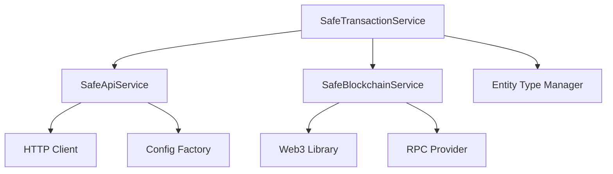

# Service Interface Contracts: Safe Smart Accounts

This document defines the interface contracts for Safe Smart Account services, providing a clear upgrade path from Phase 1 mock implementations to Phase 2 real blockchain integration.

## Overview

The Safe Smart Accounts module uses a layered service architecture:

1. **SafeApiService** - Interacts with Safe Transaction Service API
2. **SafeBlockchainService** - Direct blockchain operations via Web3
3. **SafeTransactionService** - Orchestrates transaction workflows

All services are designed with interface abstractions that allow seamless transition from mock implementations (Phase 1) to real implementations (Phase 2).

## SafeApiService Interface Contract

### Purpose
Provides abstraction for Safe Transaction Service API interactions.

### Key Methods

```php
/**
 * Gets Safe account information from Safe API.
 */
public function getSafeInfo(string $safe_address, string $network = 'sepolia'): ?array

/**
 * Gets transaction history for a Safe.
 */
public function getTransactionHistory(string $safe_address, string $network = 'sepolia', int $limit = 20, int $offset = 0): ?array

/**
 * Gets pending transactions for a Safe.
 */
public function getPendingTransactions(string $safe_address, string $network = 'sepolia'): ?array

/**
 * Proposes a new transaction to the Safe API.
 */
public function proposeTransaction(string $safe_address, array $transaction_data, string $network = 'sepolia'): ?array

/**
 * Gets gas estimation for a transaction.
 */
public function estimateGas(string $safe_address, array $transaction_data, string $network = 'sepolia'): ?array
```

### Phase 1 Implementation
- Uses `isMockMode()` to determine behavior
- Returns realistic mock data for testing
- Logs all operations for debugging
- No external API calls made

### Phase 2 Upgrade Path
1. Configure real Safe Transaction Service URLs in `safe_smart_accounts.settings.yml`
2. Set `api.mock_mode: false` in configuration  
3. Service automatically switches to real HTTP requests
4. Add API authentication if required
5. Implement retry logic and error handling

### Configuration Dependencies
```yaml
# safe_smart_accounts.settings.yml
api:
  mock_mode: true  # Set to false for Phase 2
  timeout: 30
  retry_attempts: 3
network:
  sepolia:
    safe_service_url: 'https://safe-transaction-sepolia.safe.global'
```

## SafeBlockchainService Interface Contract

### Purpose
Handles direct blockchain interactions using Web3 libraries.

### Key Methods

```php
/**
 * Deploys a new Safe Smart Account to the blockchain.
 */
public function deploySafe(array $safe_config, string $network = 'sepolia'): ?array

/**
 * Submits a Safe transaction to the blockchain.
 */
public function submitTransaction(string $safe_address, array $transaction_data, string $network = 'sepolia'): ?array

/**
 * Gets the transaction status from the blockchain.
 */
public function getTransactionStatus(string $transaction_hash, string $network = 'sepolia'): ?array

/**
 * Validates Safe signatures for a transaction.
 */
public function validateSignatures(string $safe_address, array $transaction_data, array $signatures, string $network = 'sepolia'): bool

/**
 * Gets Safe configuration from the blockchain.
 */
public function getSafeConfiguration(string $safe_address, string $network = 'sepolia'): ?array
```

### Phase 1 Implementation
- Uses `isMockMode()` for behavior switching
- Generates realistic mock blockchain responses
- Simulates deployment with random addresses
- Returns mock transaction hashes and statuses

### Phase 2 Upgrade Path
1. Install and configure web3p/web3.php dependency
2. Configure RPC endpoints in settings
3. Set `blockchain.mock_mode: false`
4. Implement wallet integration for signing
5. Add gas price optimization
6. Implement contract interaction helpers

### Configuration Dependencies
```yaml
# safe_smart_accounts.settings.yml
blockchain:
  mock_mode: true  # Set to false for Phase 2
network:
  sepolia:
    rpc_url: 'https://rpc.sepolia.org'
    chain_id: 11155111
```

### Required Dependencies for Phase 2
```bash
composer require web3p/web3.php
composer require kornrunner/keccak
composer require simplito/elliptic-php
```

## SafeTransactionService Interface Contract

### Purpose
Orchestrates complete Safe transaction workflows, coordinating between API and blockchain services.

### Key Methods

```php
/**
 * Creates a new Safe transaction proposal.
 */
public function createTransaction(SafeAccount $safe_account, array $transaction_data, int $created_by_uid): ?SafeTransaction

/**
 * Adds a signature to a transaction.
 */
public function addSignature(SafeTransaction $transaction, string $signature, string $signer_address): bool

/**
 * Executes a Safe transaction.
 */
public function executeTransaction(SafeTransaction $transaction): bool

/**
 * Updates transaction statuses by checking blockchain.
 */
public function updateTransactionStatuses(string $network = NULL): int
```

### Phase 1 Implementation
- Creates and manages SafeTransaction entities
- Simulates signature collection workflow
- Uses mock blockchain service for execution
- Provides complete transaction lifecycle management

### Phase 2 Upgrade Path
1. No interface changes required
2. Automatically benefits from real API/blockchain services
3. Add signature validation integration
4. Implement real nonce management
5. Add transaction monitoring via cron/queue

### Dependencies
- EntityTypeManagerInterface (Drupal entities)
- SafeApiService (API interactions)
- SafeBlockchainService (blockchain operations)

## Mock Mode Configuration

All services respect a centralized mock mode configuration:

```yaml
# config/install/safe_smart_accounts.settings.yml
api:
  mock_mode: true
blockchain:
  mock_mode: true
```

### Advantages of Mock Mode
1. **Rapid Development** - Test workflows without blockchain complexity
2. **Reliable Testing** - Consistent, predictable responses
3. **Offline Development** - No network dependencies
4. **Cost Effective** - No gas fees during development

## Phase 2 Integration Checklist

### Prerequisites
- [ ] Web3 PHP libraries installed
- [ ] RPC endpoints configured and tested
- [ ] Safe contract addresses verified
- [ ] Gas price strategy implemented
- [ ] Wallet integration for transaction signing

### Configuration Updates
- [ ] Set `api.mock_mode: false`
- [ ] Set `blockchain.mock_mode: false`
- [ ] Configure production RPC URLs
- [ ] Set API authentication if required
- [ ] Configure monitoring intervals

### Testing Strategy
1. **Gradual Migration** - Enable real mode for one service at a time
2. **Parallel Validation** - Compare mock vs real responses during transition
3. **Fallback Mechanisms** - Automatic fallback to mock on API failures
4. **Monitoring** - Log all real blockchain interactions

### Performance Considerations
- **Caching** - Cache blockchain queries for better performance
- **Rate Limiting** - Respect RPC provider limits
- **Retry Logic** - Implement exponential backoff for failed requests
- **Queue Processing** - Use Drupal queue for background blockchain tasks

## Error Handling Strategy

### Phase 1 (Mock Mode)
- Predictable error responses for testing
- Configurable failure rates for testing
- Detailed logging for debugging

### Phase 2 (Real Mode)
- Network timeout handling
- RPC provider failover
- Transaction failure recovery
- Gas estimation failures
- API rate limit handling

## Service Dependencies



## Future Enhancements

### Phase 3 Possibilities
1. **Multi-network Support** - Expand beyond Sepolia
2. **Advanced Monitoring** - Real-time transaction status updates
3. **Gas Optimization** - Dynamic gas price calculation
4. **Batch Operations** - Multiple transaction processing
5. **Safe Module Integration** - Support for Safe modules and guards

This interface contract ensures that Phase 1 development can proceed at full speed while maintaining a clear, tested path to full blockchain integration in Phase 2.